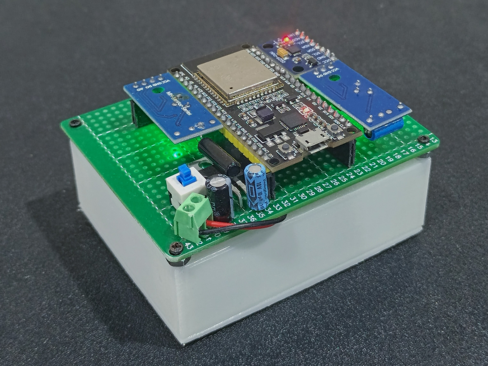
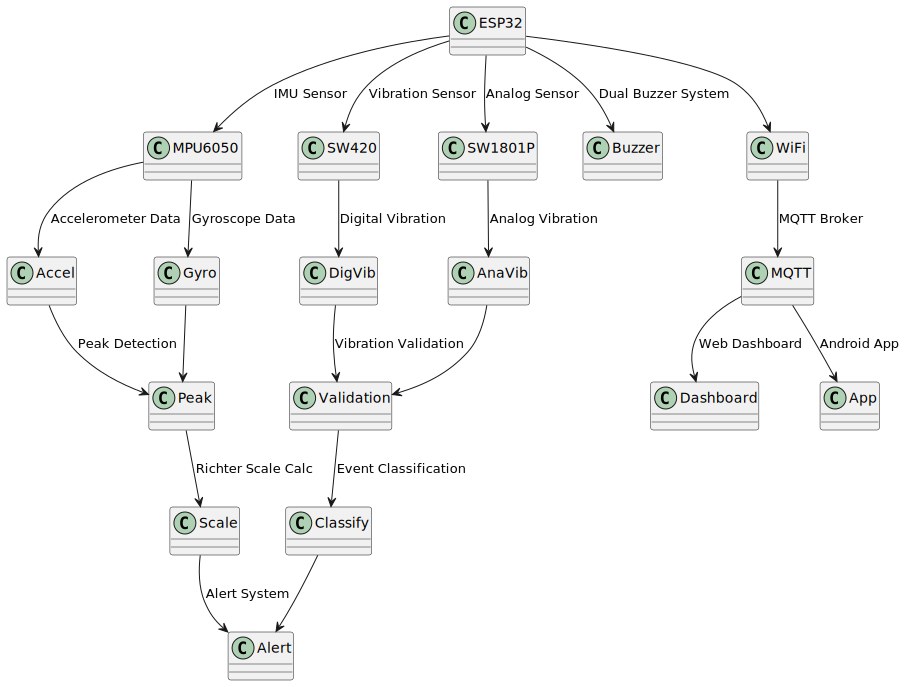
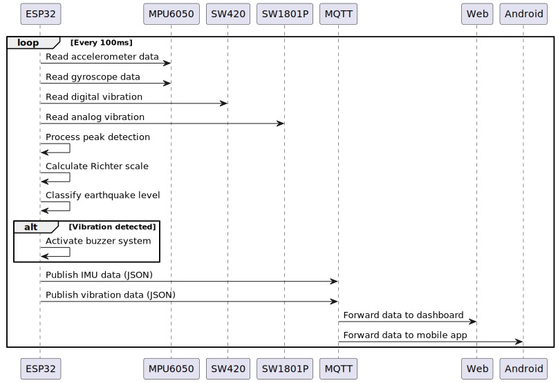

<div align="center">

# 🌍 WONDER v.2.1
## Wireless Observation for Natural Detection Earthquake Response

> **IoT-based earthquake monitoring system with real-time detection, analysis, and alerting capabilities**

[](https://www.espressif.com/en/products/socs/esp32)
[](https://mqtt.org/)
[](https://developer.mozilla.org/en-US/docs/Web/HTML)
[](https://developer.android.com/)
[](LICENSE)
[]()

[🚀 Quick Start](#-quick-start-web-dashboard) • [📋 Features](#-uiux--dashboard-features-v21) • [🛠️ Installation](#️-installation) • [📊 Architecture](#-system-architecture) • [🔬 Technical Details](#-technical-specifications)

---

</div>

## 📖 About Project

**WONDER** is an advanced IoT-based earthquake monitoring system that provides real-time detection, analysis, and alerting capabilities. The system combines multiple sensor technologies to deliver accurate earthquake intensity measurements and comprehensive monitoring through web and mobile interfaces.

### 🖼️ Prototype Reference

*Physical prototype showing ESP32 board with connected sensors and buzzer system*

### 🗺️ Schematic Diagram

*Complete wiring diagram showing all component connections and pin assignments*

### 🎯 Objectives
- Provide accurate earthquake detection using peak-to-peak amplitude analysis
- Calculate Richter scale in real-time based on sensor data
- Deliver multi-level alerting system with dual buzzer warnings
- Offer comprehensive monitoring through web dashboard and mobile app
- Demonstrate IoT implementation for natural disaster monitoring

---

## 🌟 Key Features

### 🔍 **Real-time Detection**
- ✨ Peak-to-peak amplitude analysis with 100-sample buffer
- 📊 Richter scale calculation using logarithmic formula
- 🔄 Multi-sensor validation (SW420 + SW1801P)
- 🎯 Event classification system (4 levels)
- ⚡ Real-time data processing and analysis

### 🤖 **Advanced Analytics**
- 🌐 3D IMU visualization with interactive cube model
- 📈 Real-time data streaming via MQTT
- 📝 Comprehensive event logging and history
- 📊 Performance metrics and system monitoring
- 🔄 Auto-reconnect WiFi and MQTT capabilities

### 🚨 **Alert System**
- 🔊 Dual buzzer warning system with frequency control
- 🎛️ Multi-level earthquake classification
- 📱 Real-time notifications across platforms
- 🎨 Audio-visual indicators with color coding
- ⚡ Vibration-integrated alert activation

### 📱 **Multi-Platform Access**
- 🌐 Web dashboard interface with modern UI
- 📱 Android mobile application (APK/AAB)
- ☁️ MQTT cloud connectivity
- 🔄 Cross-platform compatibility
- 📊 Data export and logging capabilities

---

## 🛠️ Technology Stack

### 🔧 **Hardware Components**
| Component | Specification | Details |
|-----------|---------------|---------|
|  | ESP32 Dev Module | Dual-core 32-bit LX6, 240MHz, WiFi/Bluetooth |
|  | MPU6050 IMU | 3-axis accelerometer (±2g), gyroscope (±250°/s) |
|  | SW420 Digital | Digital vibration sensor, GPIO 19 |
|  | SW1801P Analog | Analog vibration sensor, ADC GPIO 34 |
|  | Dual Buzzer | GPIO 12 & 14, 2.0-2.5kHz frequency range |

### 💻 **Software Stack**
| Technology | Version | Purpose |
|------------|---------|---------|
|  | 2.0+ | ESP32 firmware development |
|  | Latest | WiFi configuration management |
|  | Latest | MQTT communication |
|  | Latest | IMU sensor interface |
|  | 5.0 | Web dashboard structure |
|  | 3.0+ | CSS framework |
|  | ES6+ | Dashboard interactivity |
|  | 4.3.7 | Web MQTT communication |

### 🛠️ **Development Tools**
| Tool | Purpose |
|------|---------|
|  | Version control |
|  | Android app generation |
|  | Cloud MQTT broker |

---

## 🌟 UI/UX & Dashboard Features (v2.1)

### 🎨 **Visual Design & Animations**

#### 🌈 **Animated Background System**
- **Dynamic Gradient Animation**: Multi-layered CSS gradients with smooth color transitions
- **Shimmer Effect**: Subtle light reflection animation across the interface
- **Noise Texture Overlay**: Custom noise.png texture for organic, tactile feel
- **Responsive Animation**: Background adapts to screen size and device orientation
- **Performance Optimized**: Hardware-accelerated CSS animations for smooth 60fps

#### 🪟 **Glassmorphism & Neumorphic Design**
- **Glassmorphism (Mica)**: Translucent glass-like panels with backdrop blur effects
- **Neumorphic Elements**: Soft, extruded UI components with realistic shadows
- **Inset Effects**: Pressed-in appearance for data panels and control elements
- **Layered Depth**: Multiple z-index layers creating 3D visual hierarchy

#### 🌙 **Dark Mode System**
- **LocalStorage Persistence**: User preference saved across browser sessions
- **Smooth Transitions**: Animated color changes between light/dark themes
- **Dynamic Color Adaptation**: All UI elements automatically adapt to theme changes
- **Accessibility Compliant**: High contrast ratios for better readability

### 📱 **Interactive Features**

#### 🎛️ **Navigation & Layout**
- **Modular Tab System**: Dashboard, Vibration, 3D IMU, Graphs with smooth transitions
- **Responsive Grid Layout**: Adaptive design for desktop, tablet, and mobile devices
- **Touch-Friendly Interface**: Optimized for both mouse and touch interactions

#### 🎯 **Data Visualization**
- **3D IMU Cube**: Interactive 3D visualization with real-time rotation and scaling
- **Seven-Segment Font**: Retro-style digital display for primary data values
- **Real-time Charts**: Dynamic graph updates with smooth animations
- **Status Indicators**: Color-coded connection and sensor status displays

#### 🔄 **Real-time Updates**
- **MQTT Status Monitoring**: Live connection status with visual indicators
- **Data Streaming**: Smooth real-time data updates without page refresh
- **Event Logging**: Chronological data log with timestamp and event classification
- **Performance Metrics**: System health monitoring with visual feedback

---

## 🚀 Quick Start (Web Dashboard)

### 1️⃣ Jalankan server lokal (wajib, agar resource termuat dengan benar)
```bash
# Python
python -m http.server 8000
# atau Node.js
npx http-server -p 8000
```
Akses di: http://localhost:8000/login.html

### 2️⃣ Login MQTT
- Buka `login.html` (bukan langsung index.html!)
- Masukkan **topik MQTT apapun** sesuai kebutuhan Anda (IMU wajib, vibration opsional)
- Topik sepenuhnya custom, tidak ada batasan format atau hardcoded
- Setelah login, akan otomatis redirect ke dashboard (`index.html`)

### 3️⃣ Pastikan resource lokal tersedia
- Semua gambar, noise, dsb, ada di folder `src/images/`
- CSS & JS modular ada di `src/`

### 4️⃣ MQTT
- Gunakan broker public (misal: broker.emqx.io:1883) atau private
- Masukkan **topik MQTT custom** di halaman login (bisa topik IMU dan/atau vibration sesuai device Anda)

---

## 📋 Monitoring Options

<details>
<summary><strong>🔍 Full System Monitoring (ESP32 + All Sensors)</strong></summary>

### **Complete Setup with Vibration Sensors & Buzzer**
- **File**: `esp32/esp32.ino`
- **Sensors**: MPU6050 + SW420 + SW1801P + Dual Buzzer
- **Features**: Full earthquake detection, vibration analysis, alert system
- **Data Topics**: IMU data + Vibration data

#### **Hardware Requirements:**
- ESP32 Development Board
- MPU6050 IMU Sensor
- SW420 Digital Vibration Sensor
- SW1801P Analog Vibration Sensor  
- 2x Buzzer (GPIO 12 & 14)

#### **JSON Data Format:**
```json
// IMU Topic: YOUR_MQTT_TOPIC/data
{
  "accelX": 0.12,
  "accelY": -0.05,
  "accelZ": 9.85,
  "gyroX": 0.01,
  "gyroY": 0.02,
  "gyroZ": -0.01,
  "temp": 25.6,
  "accelMagnitude": 9.85,
  "maxPeakToPeak": 0.0,
  "richterScale": 0.0,
  "earthquakeEventActive": false,
  "earthquakeLevel": 0,
  "wifiConnected": true,
  "mqttConnected": true,
  "wifiRSSI": -45
}

// Vibration Topic: YOUR_MQTT_TOPIC/vibration
{
  "sw420": 1,
  "vibrationDetected": false,
  "vibrationCount": 0,
  "sw1801p_voltage": 3.2,
  "earthquakeDetected": false
}
```

</details>

<details>
<summary><strong>📊 IMU-Only Monitoring (Simplified Setup)</strong></summary>

### **Minimal Setup for IMU Data Only**
- **File**: `esp32/only-imu/only-imu.ino`
- **Sensors**: MPU6050 only
- **Features**: Basic IMU monitoring, no vibration detection
- **Data Topics**: IMU data only

#### **Hardware Requirements:**
- ESP32 Development Board
- MPU6050 IMU Sensor
- **No vibration sensors or buzzer required**

#### **Simplified JSON Data Format:**
```json
// IMU Topic: YOUR_MQTT_TOPIC/data
{
  "accelX": 0.12,
  "accelY": -0.05,
  "accelZ": 9.85,
  "gyroX": 0.01,
  "gyroY": 0.02,
  "gyroZ": -0.01,
  "temp": 25.6,
  "accelMagnitude": 9.85,
  "maxPeakToPeak": 0.0,
  "richterScale": 0.0,
  "wifiConnected": true,
  "mqttConnected": true,
  "wifiRSSI": -45
}
```

#### **Key Differences from Full System:**
- ❌ No `earthquakeEventActive` field
- ❌ No `earthquakeLevel` field  
- ❌ No vibration topic
- ❌ No buzzer alerts
- ✅ Simplified peak-to-peak calculation
- ✅ Basic Richter scale estimation
- ✅ WiFi and MQTT status monitoring

#### **Setup Instructions:**
1. Upload `esp32/only-imu/only-imu.ino` to ESP32
2. Configure WiFi using WiFiManager (AP: "WONDER_Wifi")
3. Update `topic_imu` variable with your MQTT topic
4. Connect MPU6050 to ESP32 I2C pins (SDA: GPIO21, SCL: GPIO22)
5. Power ESP32 and monitor Serial output
6. Use web dashboard with IMU topic only

#### **Web Dashboard Usage:**
- Login with IMU topic only (leave vibration topic empty)
- Dashboard will show IMU data and 3D visualization
- Vibration tabs will show "No data" (expected behavior)
- All IMU features work normally

</details>

---

## 📊 Configuration Comparison

### 🔄 **Full System vs IMU-Only**

| Feature | Full System | IMU-Only |
|---------|-------------|----------|
| **Hardware Complexity** | ⭐⭐⭐⭐⭐ | ⭐⭐ |
| **Setup Time** | ⭐⭐⭐⭐ | ⭐⭐ |
| **Cost** | ⭐⭐⭐⭐ | ⭐⭐ |
| **Features** | ⭐⭐⭐⭐⭐ | ⭐⭐⭐ |
| **Alert System** | ✅ Full buzzer alerts | ❌ No alerts |
| **Vibration Detection** | ✅ SW420 + SW1801P | ❌ No vibration sensors |
| **Earthquake Analysis** | ✅ Advanced peak detection | ✅ Basic peak detection |
| **3D Visualization** | ✅ Full IMU data | ✅ Full IMU data |
| **Web Dashboard** | ✅ All features | ✅ IMU features only |
| **Mobile App** | ✅ Full compatibility | ✅ IMU compatibility |

---

## 🎮 How to Use

### 📝 **Monitoring Steps**

1. **🔧 Hardware Setup**
   - Connect all sensors according to pin diagram
   - Power ESP32 with stable 3.3V supply
   - Place device on stable surface

2. **🌐 Akses Dashboard**
   - Buka `login.html` di browser (bukan langsung index.html)
   - Login dengan **topik MQTT custom** (bisa topik IMU dan/atau vibration apapun)
   - Setelah login, akan otomatis masuk ke dashboard (`index.html`)
   - Tunggu koneksi MQTT, lalu monitor data real-time

3. **📊 View Data**
   - **Richter Scale**: Real-time earthquake intensity
   - **Peak-to-Peak**: Amplitude measurements
   - **3D Visualization**: IMU orientation display
   - **Sensor Status**: Vibration detection indicators

4. **🚨 Alert System**
   - **Level 0** (< 5.0): No alert
   - **Level 1** (5.0-5.9): Light alert (2.0kHz, 200ms ON 800ms OFF)
   - **Level 2** (5.9-6.2): Moderate alert (2.2kHz, 200ms ON 300ms OFF)
   - **Level 3** (≥ 6.2): Strong alert (2.5kHz, continuous)

### ⚠️ **Important Notes**
- Ensure stable power supply for accurate readings
- Calibrate sensors on stable surface before use
- Results are for monitoring purposes, not official seismic data
- Consult professional seismic monitoring services for official data
- Regular sensor calibration and maintenance required

---

## 🏗️ System Architecture



*System architecture showing ESP32 board, sensors, data processing, and output platforms*

---

## 📊 Technical Specifications

### 🔧 **ESP32 Configuration**
| Parameter | Value | Description |
|-----------|-------|-------------|
| **CPU** | Dual-core 32-bit LX6 | 240 MHz max frequency |
| **Memory** | 520 KB SRAM | 4 MB Flash storage |
| **ADC Resolution** | 12-bit | 0-4095 range |
| **I2C Frequency** | Default | Standard I2C speed |
| **WiFi** | 802.11 b/g/n | Auto-reconnect enabled |
| **MQTT Buffer** | 1024 bytes | Message buffer size |

### 📡 **Sensor Specifications**

#### **Full System Configuration**
| Sensor | Type | Range | Resolution | Sample Rate | GPIO |
|--------|------|-------|------------|-------------|------|
| **MPU6050 Accel** | 3-axis | ±2g | 16-bit | 184 Hz | I2C |
| **MPU6050 Gyro** | 3-axis | ±250°/s | 16-bit | 184 Hz | I2C |
| **SW420** | Digital | HIGH/LOW | 1-bit | Real-time | GPIO 19 |
| **SW1801P** | Analog | 0-3.3V | 12-bit | Real-time | GPIO 34 |
| **Buzzer 1** | Digital | 2.0-2.5kHz | - | Variable | GPIO 12 |
| **Buzzer 2** | Digital | 2.0-2.5kHz | - | Variable | GPIO 14 |


### 🌐 **Network Configuration**
| Parameter | Full System | IMU-Only | Description |
|-----------|-------------|----------|-------------|
| **MQTT Broker** | broker.emqx.io | broker.emqx.io | Public EMQX broker |
| **Port** | 1883 | 1883 | Standard MQTT port |
| **Client ID** | esp32-client | esp32-imu-client | Unique identifier |
| **IMU Topic** | Custom | Custom | MQTT topic for IMU data |
| **Vibration Topic** | Custom | - | MQTT topic for vibration data |
| **QoS** | 0 | 0 | At most once delivery |
| **Buffer Size** | 1024 bytes | 1024 bytes | Message buffer |

### 📱 **App Specifications**
| Platform | Version | Size | Package | Compatibility |
|----------|---------|------|---------|---------------|
| **Android APK** | 2.1 | 939KB | com.bangtanniot.wonder | Full System + IMU-Only |
| **Android AAB** | 2.1 | 1.0MB | com.bangtanniot.wonder | Full System + IMU-Only |
| **Web Dashboard** | 1.0 | 32KB | HTML5 application | Full System + IMU-Only |

---

## 📈 Data Flow

### 🔄 **Real-time Data Pipeline**



*Real-time data flow showing sensor readings, processing pipeline, and output distribution*

### 📊 **Data Structure**

#### 🔍 **Full System/IMU-Only - IMU Data Topic** (`YOUR_MQTT_TOPICS/data`)
```json
{
  "accelX": 0.12,
  "accelY": -0.05,
  "accelZ": 9.85,
  "gyroX": 0.01,
  "gyroY": 0.02,
  "gyroZ": -0.01,
  "temp": 25.6,
  "accelMagnitude": 9.85,
  "maxPeakToPeak": 0.0,
  "richterScale": 0.0,
  "earthquakeEventActive": false,
  "earthquakeLevel": 0,
  "wifiConnected": true,
  "mqttConnected": true,
  "wifiRSSI": -45
}
```

#### 🔔 **Vibration Data Topic** (`YOUR_MQTT_TOPICS/vibration`) - Full System Only
```json
{
  "sw420": 1,
  "vibrationDetected": false,
  "vibrationCount": 0,
  "sw1801p_voltage": 3.2,
  "earthquakeDetected": false
}
```

---

## 🔍 API Documentation

### 📡 **MQTT Topics**

#### **Full System Configuration**
| Topic | Type | Description | Payload |
|-------|------|-------------|---------|
| `YOUR_MQTT_TOPICS/data` | Publish | IMU sensor data with earthquake detection | JSON object |
| `YOUR_MQTT_TOPICS/vibration` | Publish | Vibration sensor data | JSON object |

#### **IMU-Only Configuration**
| Topic | Type | Description | Payload |
|-------|------|-------------|---------|
| `YOUR_MQTT_TOPICS/data` | Publish | IMU sensor data (simplified) | JSON object |

### 🔧 **Configuration Parameters**

#### 📊 **Detection Parameters (Full System)**
```cpp
// Peak Detection
const int PEAK_BUFFER_SIZE = 100;           // Circular buffer size
const float PEAK_DETECTION_THRESHOLD = 5;   // m/s² minimum threshold
const unsigned long EARTHQUAKE_TIMEOUT = 500; // Event timeout (ms)

// Vibration Detection
const unsigned long VIBRATION_TIMEOUT_MS = 1500; // Vibration timeout (ms)
const int SW1801P_THRESHOLD = 3300;        // mV threshold for SW1801P
```

#### 📊 **Detection Parameters (IMU-Only)**
```cpp
// Simplified Peak Detection
float maxPeakToPeak = 0;                    // Basic peak tracking
float richterScale = 0;                     // Simplified Richter calculation
```

#### 🌐 **Network Parameters (Both Configurations)**
```cpp
// WiFi Configuration
const char* ssid = "YOUR_WIFI_SSID";
const char* password = "YOUR_WIFI_PASSWORD";

// MQTT Configuration
const char* mqtt_server = "broker.emqx.io";
const int mqtt_port = 1883;
const char* mqtt_client_id = "esp32-client";        // Full system
const char* mqtt_client_id = "esp32-imu-client";    // IMU-only
```

#### 🔔 **Alert Parameters (Full System Only)**
```cpp
// Buzzer Frequencies
const int BUZZER_LIGHT_FREQ = 2000;    // 2.0kHz for light earthquake
const int BUZZER_MODERATE_FREQ = 2200; // 2.2kHz for moderate earthquake
const int BUZZER_STRONG_FREQ = 2500;   // 2.5kHz for strong earthquake

// Timing Patterns
const int BUZZER_ON_TIME = 200;        // 200ms ON time
const int BUZZER_LIGHT_OFF = 800;      // 800ms OFF for light
const int BUZZER_MODERATE_OFF = 300;   // 300ms OFF for moderate
```

### 📊 **Data Processing Functions**

#### **calculateRichterScale(float peakToPeak)**
```cpp
float calculateRichterScale(float peakToPeak) {
  if (peakToPeak <= 0) return 0;
  
  // Convert m/s² to mm/s²
  float amplitudeMM = peakToPeak * 1000;
  
  // Richter scale formula: M = log10(A) + C
  float richter = log10(amplitudeMM) + 2.0;
  
  // Limit to 0-10 range
  if (richter < 0) richter = 0;
  if (richter > 10) richter = 10;
  
  return richter;
}
```

#### **detectPeaks(float accelMagnitude)**
```cpp
void detectPeaks(float accelMagnitude) {
  // Add to circular buffer
  accelBuffer[bufferIndex] = accelMagnitude;
  bufferIndex = (bufferIndex + 1) % PEAK_BUFFER_SIZE;
  
  // Calculate peak-to-peak from buffer
  float currentPeakToPeak = maxVal - minVal;
  
  // Update if significant oscillation detected
  if (currentPeakToPeak > PEAK_DETECTION_THRESHOLD) {
    maxPeakToPeak = currentPeakToPeak;
    peakDetected = true;
    // Start earthquake event if not active
  }
}
```

---

## 📂 Project Structure

```
WONDER-2.1/
├── esp32/                      # ESP32 firmware files
│   ├── esp32.ino              # Full system firmware (all sensors)
│   └── only-imu/              # IMU-only firmware
│       └── only-imu.ino       # Simplified firmware (MPU6050 only)
├── android/                    # Android application files
│   ├── apps/                  # Generated APK/AAB files
│   ├── certification.txt      # App certification details
│   ├── license.txt           # App license information
│   ├── readme.txt            # Android app documentation
│   └── WebIntoApp URLs       # App builder references
├── src/
│   ├── css/
│   │   └── style.css         # Modular CSS (Tailwind + custom)
│   ├── js/                   # Modular JavaScript files
│   │   ├── main.js           # Main dashboard logic
│   │   ├── mqtt.js           # MQTT communication handler
│   │   ├── ui.js             # UI interactions and animations
│   │   ├── chart.js          # Chart.js integration
│   │   └── login.js          # Login form handler
│   └── images/               # Project assets and diagrams
│       ├── noise.png         # Background texture
│       ├── proto.jpg         # Physical prototype image
│       ├── system-architecture.svg
│       ├── data-flow.svg
│       └── schematic/        # Hardware schematics
│           └── Schematic_iot_esp32_gempa.png
├── index.html                # Main web dashboard (redirect from login)
├── login.html                # MQTT topic configuration page
├── LICENSE                   # MIT License
└── README.md                 # Project documentation
```

---

## 📝 Important Notes

### ⚠️ **Warnings**
- Ensure all dependencies are properly installed
- This system uses pre-trained algorithms for earthquake detection
- **Results are for monitoring purposes, not official seismic data**
- Consult professional seismic monitoring services for official data
- Regular sensor calibration and maintenance required

### 📋 **Configuration-Specific Notes**

#### **Full System Configuration**
- Requires all sensors (MPU6050, SW420, SW1801P) for optimal performance
- Buzzer system provides immediate audio alerts during events
- Vibration sensors enhance detection accuracy and reduce false positives
- Higher power consumption due to multiple sensors and buzzer system
- More complex wiring and setup process

#### **IMU-Only Configuration**
- Simplified setup with only MPU6050 sensor required
- Lower power consumption and cost
- Basic earthquake detection using accelerometer data only
- No audio alerts or vibration sensor validation
- Suitable for learning and prototyping purposes

### 📋 **Technical Information**
- Firmware runs on ESP32 with real-time processing
- Web dashboard requires modern browser with JavaScript enabled
- MQTT broker is public service, consider private broker for production
- Android app generated using WebIntoApp.com platform
- All data is transmitted in JSON format
- Both configurations support WiFiManager for easy WiFi setup

### 🔧 **Future Development**
- Integration with official seismic monitoring networks
- Machine learning algorithms for improved accuracy
- Cloud storage for historical data analysis
- Mobile app with native Android features
- Multi-device network for wider coverage

---

## 🔧 Troubleshooting

### 🚨 **Common Issues & Solutions**

#### **Full System Configuration**
| Issue | Symptom | Solution |
|-------|---------|----------|
| **MPU6050 not detected** | "Failed to find MPU6050 chip" | Check I2C connections (SDA: GPIO21, SCL: GPIO22) |
| **SW420 always HIGH** | No vibration detection | Check GPIO 19 connection and sensor orientation |
| **SW1801P voltage stuck** | Always 0V or 3.3V | Check GPIO 34 connection and sensor calibration |
| **Buzzer not working** | No sound during alerts | Check GPIO 12 & 14 connections and power supply |
| **WiFi connection drops** | Frequent disconnections | Check WiFi signal strength and router settings |
| **MQTT publish fails** | "MQTT not connected" | Verify broker URL, port, and network connectivity |

#### **IMU-Only Configuration**
| Issue | Symptom | Solution |
|-------|---------|----------|
| **MPU6050 not detected** | "Failed to find MPU6050 chip" | Check I2C connections (SDA: GPIO21, SCL: GPIO22) |
| **WiFi connection drops** | Frequent disconnections | Check WiFi signal strength and router settings |
| **MQTT publish fails** | "MQTT not connected" | Verify broker URL, port, and network connectivity |
| **Web dashboard shows no data** | Empty charts and displays | Check MQTT topic configuration in login page |

#### **Web Dashboard Issues**
| Issue | Symptom | Solution |
|-------|---------|----------|
| **404 errors for images** | Missing noise.png or other assets | Ensure server is running from project root directory |
| **MQTT helpers not available** | Console shows "Required helpers not available" | Check script loading order in index.html |
| **Chart.js errors** | "Chart is not defined" | Verify Chart.js CDN is loaded before chart.js |
| **Dark mode not working** | Theme doesn't persist | Check localStorage permissions in browser |

### 🔍 **Debug Information**

#### **Serial Monitor Output**
```
// Successful startup (Full System)
I2C device found at address 0x68
MPU6050 Found!
SW420 sensor initialized on GPIO 19
Dual buzzer system initialized on G12 and G14
WiFi connected! IP: 192.168.1.100
MQTT connected successfully!

// Successful startup (IMU-Only)
I2C device found at address 0x68
MPU6050 Found!
WiFi connected! IP: 192.168.1.100
MQTT connected successfully!
```

#### **MQTT Data Verification**
```bash
# Test MQTT connection (replace with your topic)
mosquitto_sub -h broker.emqx.io -p 1883 -t "YOUR_TOPIC/data"
mosquitto_sub -h broker.emqx.io -p 1883 -t "YOUR_TOPIC/vibration"
```

---

## 📋 Quick Reference

### 🚀 **Quick Setup Commands**

#### **Full System**
```bash
# 1. Upload firmware
# Open esp32/esp32.ino in Arduino IDE
# Upload to ESP32

# 2. Start web server
python -m http.server 8000

# 3. Access dashboard
# Open http://localhost:8000/login.html
# Enter MQTT topics: YOUR_TOPIC/data and YOUR_TOPIC/vibration
```

#### **IMU-Only**
```bash
# 1. Upload firmware
# Open esp32/only-imu/only-imu.ino in Arduino IDE
# Upload to ESP32

# 2. Start web server
python -m http.server 8000

# 3. Access dashboard
# Open http://localhost:8000/login.html
# Enter MQTT topic: YOUR_TOPIC/data (leave vibration empty)
```

### 🔧 **Hardware Pinout**

#### **Full System**
| Component | ESP32 Pin | Connection |
|-----------|-----------|------------|
| MPU6050 SDA | GPIO 21 | I2C Data |
| MPU6050 SCL | GPIO 22 | I2C Clock |
| SW420 | GPIO 19 | Digital Input |
| SW1801P | GPIO 34 | Analog Input |
| Buzzer 1 | GPIO 12 | Digital Output |
| Buzzer 2 | GPIO 14 | Digital Output |

#### **IMU-Only**
| Component | ESP32 Pin | Connection |
|-----------|-----------|------------|
| MPU6050 SDA | GPIO 21 | I2C Data |
| MPU6050 SCL | GPIO 22 | I2C Clock |

### 📊 **MQTT Topics**

#### **Full System**
- **IMU Data**: `YOUR_TOPIC/data`
- **Vibration Data**: `YOUR_TOPIC/vibration`

#### **IMU-Only**
- **IMU Data**: `YOUR_TOPIC/data`

### 🎯 **Key Features Comparison**

| Feature | Full System | IMU-Only |
|---------|-------------|----------|
| **Sensors** | MPU6050 + SW420 + SW1801P | MPU6050 only |
| **Alerts** | Dual buzzer system | None |
| **Detection** | Multi-sensor validation | Basic accelerometer |
| **Accuracy** | High (validated) | Medium (basic) |
| **Setup Time** | 30-45 minutes | 10-15 minutes |
| **Cost** | ~$25-35 | ~$15-20 |

---

## 📄 License

This project is licensed under the **MIT License** - see the [LICENSE](LICENSE) file for details.

**Key Points:**
- ✅ Commercial use allowed
- ✅ Modification allowed
- ✅ Distribution allowed
- ✅ Private use allowed
- ❌ No warranty provided
- ❌ No liability assumed

---

## 🧑‍💻 Developer

<div align="center">

### **Moch. Shultan Ali Saifuddin**

[](https://github.com/mochshultan)

**Developed with ❤️ for Internet of Things course project**

---

### 🌟 **Star History**

[](https://star-history.com/#mochshultan/wonder-iot&Date)

---

<div align="center">

**If this project helps you, give it a ⭐ star!**

[](https://github.com/mochshultan/wonder-iot)
[](https://github.com/mochshultan/wonder-iot)
[](https://github.com/mochshultan/wonder-iot/issues)

</div>
