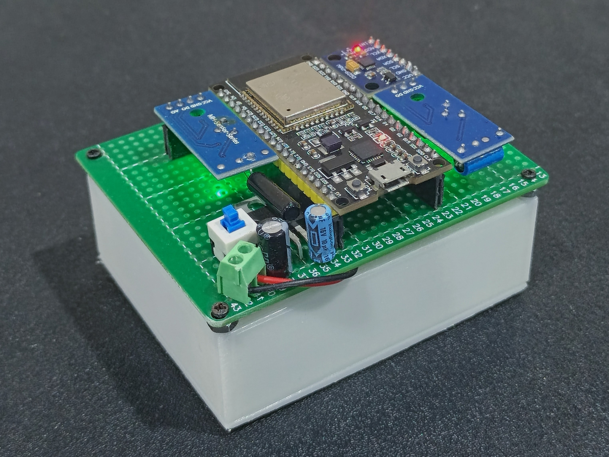
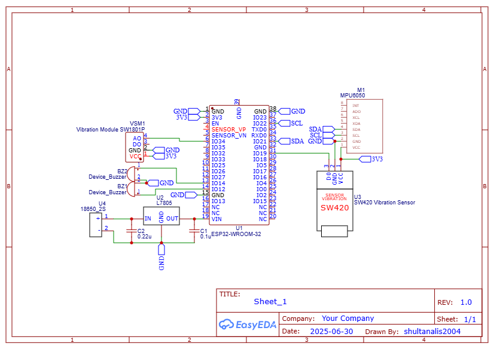
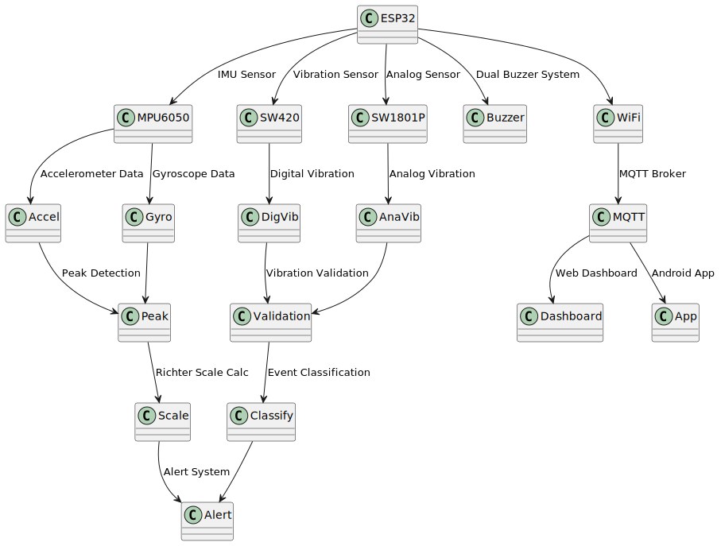
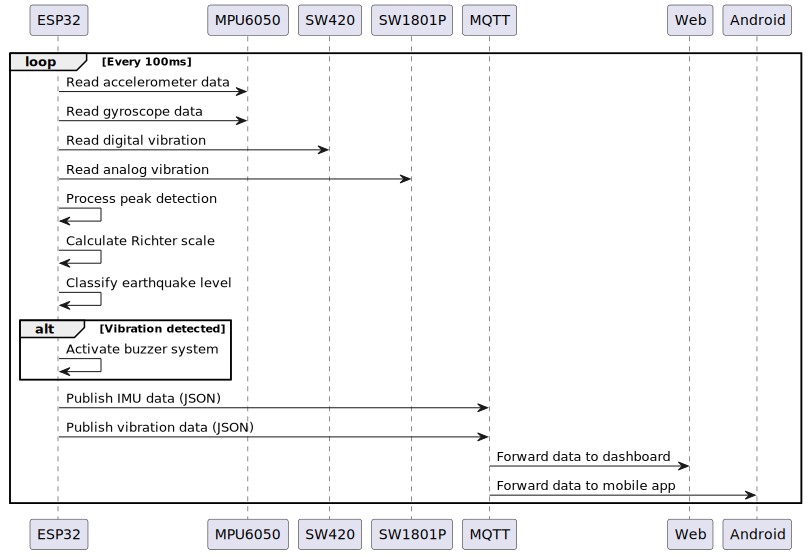

<div align="center">

# 🌍 WONDER 2.1
## Wireless Observation for Natural Detection Earthquake Response

> **IoT-based earthquake monitoring system with real-time detection, analysis, and alerting capabilities**

[](https://www.espressif.com/en/products/socs/esp32)
[](https://mqtt.org/)
[](https://developer.mozilla.org/en-US/docs/Web/HTML)
[](https://developer.android.com/)
[](LICENSE)
[]()

[🚀 Quick Start](#-quick-start) • [📋 Features](#-features) • [🛠️ Installation](#️-installation) • [📊 Architecture](#-system-architecture) • [🔬 Technical Details](#-technical-specifications) • [🔧 Hardware Build](#-hardware-build)

---

</div>

## 📖 About Project

**WONDER** is an advanced IoT-based earthquake monitoring system that provides real-time detection, analysis, and alerting capabilities. The system combines multiple sensor technologies to deliver accurate earthquake intensity measurements and comprehensive monitoring through web and mobile interfaces.

### 🎯 Objectives
- Provide accurate earthquake detection using peak-to-peak amplitude analysis
- Calculate Richter scale in real-time based on sensor data
- Deliver multi-level alerting system with dual buzzer warnings
- Offer comprehensive monitoring through web dashboard and mobile app
- Demonstrate IoT implementation for natural disaster monitoring

---

## 🌟 Key Features

### 🔍 **Real-time Detection**
- ✨ Peak-to-peak amplitude analysis with 100-sample buffer
- 📊 Richter scale calculation using logarithmic formula
- 🔄 Multi-sensor validation (SW420 + SW1801P)
- 🎯 Event classification system (4 levels)
- ⚡ Real-time data processing and analysis

### 🤖 **Advanced Analytics**
- 🌐 3D IMU visualization with interactive cube model
- 📈 Real-time data streaming via MQTT
- 📝 Comprehensive event logging and history
- 📊 Performance metrics and system monitoring
- 🔄 Auto-reconnect WiFi and MQTT capabilities

### 🚨 **Alert System**
- 🔊 Dual buzzer warning system with frequency control
- 🎛️ Multi-level earthquake classification
- 📱 Real-time notifications across platforms
- 🎨 Audio-visual indicators with color coding
- ⚡ Vibration-integrated alert activation

### 📱 **Multi-Platform Access**
- 🌐 Web dashboard interface with modern UI
- 📱 Android mobile application (APK/AAB)
- ☁️ MQTT cloud connectivity
- 🔄 Cross-platform compatibility
- 📊 Data export and logging capabilities

---

## 🛠️ Technology Stack

### 🔧 **Hardware Components**
| Component | Specification | Details |
|-----------|---------------|---------|
|  | ESP32 Dev Module | Dual-core 32-bit LX6, 240MHz, WiFi/Bluetooth |
|  | MPU6050 IMU | 3-axis accelerometer (±2g), gyroscope (±250°/s) |
|  | SW420 Digital | Digital vibration sensor, GPIO 19 |
|  | SW1801P Analog | Analog vibration sensor, ADC GPIO 34 |
|  | Dual Buzzer | GPIO 12 & 14, 2.0-2.5kHz frequency range |

### 💻 **Software Stack**
| Technology | Version | Purpose |
|------------|---------|---------|
|  | 2.0+ | ESP32 firmware development |
|  | Latest | WiFi configuration management |
|  | Latest | MQTT communication |
|  | Latest | IMU sensor interface |
|  | 5.0 | Web dashboard structure |
|  | 3.0+ | CSS framework |
|  | ES6+ | Dashboard interactivity |
|  | 4.3.7 | Web MQTT communication |

### 🛠️ **Development Tools**
| Tool | Purpose |
|------|---------|
|  | Version control |
|  | Android app generation |
|  | Cloud MQTT broker |

---

## 🚀 Quick Start

### 📋 **Prerequisites**
- ESP32 development board
- MPU6050, SW420, SW1801P sensors
- Arduino IDE 2.0+
- WiFi connection
- MQTT broker access

### 🔧 **Hardware Setup**

#### **Prototype Reference**


*Physical prototype showing ESP32 board with connected sensors and buzzer system*

#### **Schematic Diagram**


*Complete wiring diagram showing all component connections and pin assignments*

#### **Sensor Connections**
```
MPU6050:
├── VCC → 3.3V
├── GND → GND
├── SDA → GPIO 21
└── SCL → GPIO 22

SW420:
├── VCC → 3.3V
├── GND → GND
└── OUT → GPIO 19

SW1801P:
├── VCC → 3.3V
├── GND → GND
└── OUT → GPIO 34 (ADC1_CH6)

Buzzers:
├── Buzzer 1 → GPIO 12
└── Buzzer 2 → GPIO 14
```

### 💻 **Software Installation**

#### 1️⃣ **Install Arduino Libraries**
```bash
# Arduino IDE Library Manager
Tools → Manage Libraries:
├── WiFiManager
├── PubSubClient
├── Adafruit MPU6050
└── Adafruit Unified Sensor
```

#### 2️⃣ **Configure WiFi Settings**
```cpp
// Update in esp32-imu.ino
const char* ssid = "YOUR_WIFI_SSID";
const char* password = "YOUR_WIFI_PASSWORD";
```

#### 3️⃣ **Upload Firmware**
```bash
# Select board
Tools → Board → ESP32 Arduino → ESP32 Dev Module

# Configure settings
Tools → Upload Speed → 115200
Tools → Port → [Select ESP32 COM port]

# Upload
Sketch → Upload
```

### 🌐 **Web Dashboard Setup**

#### **Local Deployment**
```bash
# Python HTTP server
python -m http.server 8000

# Or Node.js
npx http-server -p 8000

# Access dashboard
http://localhost:8000
```

#### **MQTT Configuration**
- **Broker**: `broker.emqx.io:1883`
- **Topics**: 
  - `YOUR_MQTT_TOPIC/data` (IMU data)
  - `YOUR_MQTT_TOPIC/vibration` (Vibration data)
- **Auto-connect**: Enabled

### 📱 **Android App Installation**

#### **Install APK**
```bash
# Enable unknown sources
Settings → Security → Unknown Sources

# Install APK
adb install android/app-release.apk

# Or download manually
File: android/app-release.apk (939KB)
```

---

## 🎮 How to Use

### 📝 **Monitoring Steps**

1. **🔧 Hardware Setup**
   - Connect all sensors according to pin diagram
   - Power ESP32 with stable 3.3V supply
   - Place device on stable surface

2. **🌐 Access Dashboard**
   - Open `index.html` in web browser
   - Wait for MQTT connection to establish
   - Monitor real-time sensor data

3. **📊 View Data**
   - **Richter Scale**: Real-time earthquake intensity
   - **Peak-to-Peak**: Amplitude measurements
   - **3D Visualization**: IMU orientation display
   - **Sensor Status**: Vibration detection indicators

4. **🚨 Alert System**
   - **Level 0** (< 5.0): No alert
   - **Level 1** (5.0-5.9): Light alert (2.0kHz, 200ms ON 800ms OFF)
   - **Level 2** (5.9-6.2): Moderate alert (2.2kHz, 200ms ON 300ms OFF)
   - **Level 3** (≥ 6.2): Strong alert (2.5kHz, continuous)

### ⚠️ **Important Notes**
- Ensure stable power supply for accurate readings
- Calibrate sensors on stable surface before use
- Results are for monitoring purposes, not official seismic data
- Consult professional seismic monitoring services for official data
- Regular sensor calibration and maintenance required

---

## 🏗️ System Architecture



*System architecture showing ESP32 board, sensors, data processing, and output platforms*

---

## 📊 Technical Specifications

### 🔧 **ESP32 Configuration**
| Parameter | Value | Description |
|-----------|-------|-------------|
| **CPU** | Dual-core 32-bit LX6 | 240 MHz max frequency |
| **Memory** | 520 KB SRAM | 4 MB Flash storage |
| **ADC Resolution** | 12-bit | 0-4095 range |
| **I2C Frequency** | Default | Standard I2C speed |
| **WiFi** | 802.11 b/g/n | Auto-reconnect enabled |
| **MQTT Buffer** | 1024 bytes | Message buffer size |

### 📡 **Sensor Specifications**
| Sensor | Type | Range | Resolution | Sample Rate |
|--------|------|-------|------------|-------------|
| **MPU6050 Accel** | 3-axis | ±2g | 16-bit | 184 Hz |
| **MPU6050 Gyro** | 3-axis | ±250°/s | 16-bit | 184 Hz |
| **SW420** | Digital | HIGH/LOW | 1-bit | Real-time |
| **SW1801P** | Analog | 0-3.3V | 12-bit | Real-time |

### 🌐 **Network Configuration**
| Parameter | Value | Description |
|-----------|-------|-------------|
| **MQTT Broker** | broker.emqx.io | Public EMQX broker |
| **Port** | 1883 | Standard MQTT port |
| **Client ID** | esp32-client | Unique identifier |
| **Topics** | MOCH/SHULTAN/163231040/* | Namespace structure |
| **QoS** | 0 | At most once delivery |

### 📱 **App Specifications**
| Platform | Version | Size | Package |
|----------|---------|------|---------|
| **Android APK** | 2.1 | 939KB | com.bangtanniot.wonder |
| **Android AAB** | 2.1 | 1.0MB | com.bangtanniot.wonder |
| **Web Dashboard** | 1.0 | 32KB | HTML5 application |

---

## 📈 Data Flow

### 🔄 **Real-time Data Pipeline**



*Real-time data flow showing sensor readings, processing pipeline, and output distribution*

### 📊 **Data Structure**

#### 🔍 **IMU Data Topic** (`YOUR_MQTT_TOPICS/data`)
```json
{
  "accelX": 0.12,
  "accelY": -0.05,
  "accelZ": 9.85,
  "gyroX": 0.01,
  "gyroY": 0.02,
  "gyroZ": -0.01,
  "temp": 25.6,
  "accelMagnitude": 9.85,
  "maxPeakToPeak": 0.0,
  "richterScale": 0.0,
  "earthquakeEventActive": false,
  "earthquakeLevel": 0,
  "wifiConnected": true,
  "mqttConnected": true,
  "wifiRSSI": -45
}
```

#### 🔔 **Vibration Data Topic** (`YOUR_MQTT_TOPICS/vibration`)
```json
{
  "sw420": 1,
  "vibrationDetected": false,
  "vibrationCount": 0,
  "sw1801p_voltage": 3.2,
  "earthquakeDetected": false
}
```

---

## 🔍 API Documentation

### 📡 **MQTT Topics**
| Topic | Type | Description | Payload |
|-------|------|-------------|---------|
| `YOUR_MQTT_TOPICS/data` | Publish | IMU sensor data | JSON object |
| `YOUR_MQTT_TOPICS/vibration` | Publish | Vibration sensor data | JSON object |

### 🔧 **Configuration Parameters**

#### 📊 **Detection Parameters**
```cpp
// Peak Detection
const int PEAK_BUFFER_SIZE = 100;           // Circular buffer size
const float PEAK_DETECTION_THRESHOLD = 5;   // m/s² minimum threshold
const unsigned long EARTHQUAKE_TIMEOUT = 500; // Event timeout (ms)

// Vibration Detection
const unsigned long VIBRATION_TIMEOUT_MS = 1500; // Vibration timeout (ms)
const int SW1801P_THRESHOLD = 3300;        // mV threshold for SW1801P
```

#### 🌐 **Network Parameters**
```cpp
// WiFi Configuration
const char* ssid = "FTMM@AIRLANGGA-HOTSPOT";
const char* password = "@irlangg@";

// MQTT Configuration
const char* mqtt_server = "broker.emqx.io";
const int mqtt_port = 1883;
const char* mqtt_client_id = "esp32-client";
```

#### 🔔 **Alert Parameters**
```cpp
// Buzzer Frequencies
const int BUZZER_LIGHT_FREQ = 2000;    // 2.0kHz for light earthquake
const int BUZZER_MODERATE_FREQ = 2200; // 2.2kHz for moderate earthquake
const int BUZZER_STRONG_FREQ = 2500;   // 2.5kHz for strong earthquake

// Timing Patterns
const int BUZZER_ON_TIME = 200;        // 200ms ON time
const int BUZZER_LIGHT_OFF = 800;      // 800ms OFF for light
const int BUZZER_MODERATE_OFF = 300;   // 300ms OFF for moderate
```

### 📊 **Data Processing Functions**

#### **calculateRichterScale(float peakToPeak)**
```cpp
float calculateRichterScale(float peakToPeak) {
  if (peakToPeak <= 0) return 0;
  
  // Convert m/s² to mm/s²
  float amplitudeMM = peakToPeak * 1000;
  
  // Richter scale formula: M = log10(A) + C
  float richter = log10(amplitudeMM) + 2.0;
  
  // Limit to 0-10 range
  if (richter < 0) richter = 0;
  if (richter > 10) richter = 10;
  
  return richter;
}
```

#### **detectPeaks(float accelMagnitude)**
```cpp
void detectPeaks(float accelMagnitude) {
  // Add to circular buffer
  accelBuffer[bufferIndex] = accelMagnitude;
  bufferIndex = (bufferIndex + 1) % PEAK_BUFFER_SIZE;
  
  // Calculate peak-to-peak from buffer
  float currentPeakToPeak = maxVal - minVal;
  
  // Update if significant oscillation detected
  if (currentPeakToPeak > PEAK_DETECTION_THRESHOLD) {
    maxPeakToPeak = currentPeakToPeak;
    peakDetected = true;
    // Start earthquake event if not active
  }
}
```

---

## 📂 Project Structure

```
WONDER 2.1/
├── 📁 android/                    # Android application files
│   ├── 📱 app-release.apk        # Installable APK (939KB)
│   ├── 📦 app-release.aab        # App Bundle (1.0MB)
│   ├── 🔑 my-release-key.jks     # Signing key
│   ├── 📄 certification.txt      # App certification
│   ├── 📄 license.txt           # License information
│   ├── 📄 readme.txt            # App documentation
│   └── 🔗 WebIntoApp URLs       # Development platform links
├── 📁 images/                     # Project diagrams and images
│   ├── 🏗️ system-architecture.svg # System architecture diagram
│   └── 📊 data-flow.svg          # Real-time data flow diagram
├── 📁 schematic/                  # Hardware schematics and wiring
│   └── 🔌 Schematic_iot_esp32_gempa.png # Complete wiring diagram
├── 🔧 esp32-imu.ino             # ESP32 firmware (690 lines)
├── 🌐 index.html                # Web dashboard (647 lines)
├── 📸 proto.jpg                 # Project prototype image (5.2MB)
├── 📄 LICENSE                   # MIT License file
└── 📖 README.md                 # Project documentation
```

---

## 📝 Important Notes

### ⚠️ **Warnings**
- Ensure all dependencies are properly installed
- This system uses pre-trained algorithms for earthquake detection
- **Results are for monitoring purposes, not official seismic data**
- Consult professional seismic monitoring services for official data
- Regular sensor calibration and maintenance required

### 📋 **Technical Information**
- Firmware runs on ESP32 with real-time processing
- Web dashboard requires modern browser with JavaScript enabled
- MQTT broker is public service, consider private broker for production
- Android app generated using WebIntoApp.com platform
- All data is transmitted in JSON format

### 🔧 **Future Development**
- Integration with official seismic monitoring networks
- Machine learning algorithms for improved accuracy
- Cloud storage for historical data analysis
- Mobile app with native Android features
- Multi-device network for wider coverage

---

## 📄 License

This project is licensed under the **MIT License** - see the [LICENSE](LICENSE) file for details.

**Key Points:**
- ✅ Commercial use allowed
- ✅ Modification allowed
- ✅ Distribution allowed
- ✅ Private use allowed
- ❌ No warranty provided
- ❌ No liability assumed

---

## 🧑‍💻 Developer

<div align="center">

### **Moch. Shultan Ali Saifuddin**

[](https://github.com/mochshultan)

**Developed with ❤️ for Internet of Things course project**

---

### 🌟 **Star History**

[](https://star-history.com/#mochshultan/wonder-iot&Date)

---

<div align="center">

**If this project helps you, give it a ⭐ star!**

[](https://github.com/mochshultan/wonder-iot)
[](https://github.com/mochshultan/wonder-iot)
[](https://github.com/mochshultan/wonder-iot/issues)

</div>